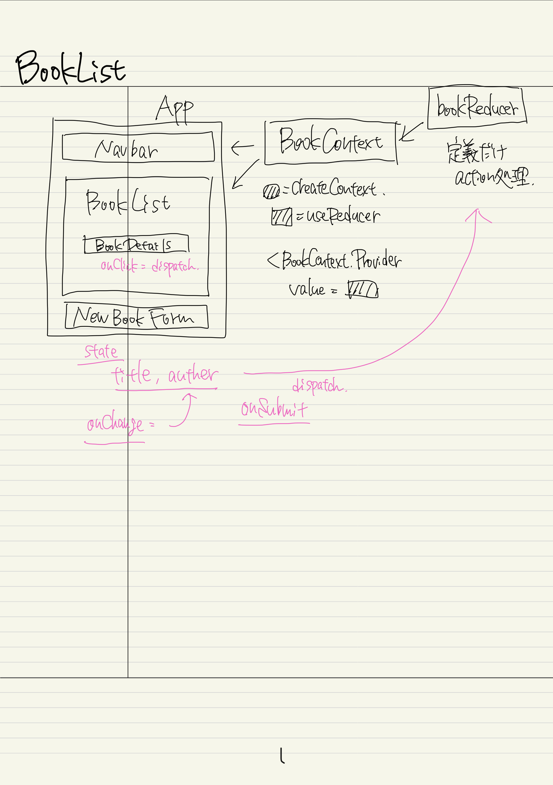

# React Context & Hooks Tutorial - The Net Ninja

## BookList App

### context + reducer / localStorage

https://github.com/iamshaunjp/react-context-hooks

## 16 Reading List Project part1

## 17 Reading List Project part2

-   BookList.component & BookDetails.component 作成

## 18 Reading List Project part3

-   BookForm.component 作成
-   タイトル・著者入力すると、リストに追加される

## 20 Adding a Reducer

-   bookReducer 作成
-   context はすっきりする。onClick などで action を dispatch する

## 21 Adding Local Storage

-   list を localStorage に保存
-   ページ更新時には localStorage データを持ってくる

---

## 1 Introduction

-   :sunny: vscode スニペット AutoComplete-別コンポーネントは直接 JSX 内に書き込むと、autoComplete 候補が出てくる。-> わざわざ import 書かなくて済む

## 3 Adding a Context & Provider

-   :white_check_mark: createContext, ラップするところまで

## 4 Accessing Context part1

-   App からの context が navbar,booklist まで渡るようにした

## 5 Accessing Context part2

-   Consumer 使うパターン

## 6 Updating Context Data

-   テーマ切り替えボタン実装。
-   コンテキスト内にメソッド配置。そのメソッドが context で流れる。ボタンクリックでメソッド発動するように。

## 7 Creating Multiple Contexts

-   認証状態を管理する context 追加。

## 8 Consuming Multiple Contexts

-   １つのコンポーネント内で、複数の context 使うには？

## 9-12 基本的な Hooks について

-   https://github.com/tutu-tonton/react-hooks-thenetninja

## 13 Hooks with Context

-   BookListComponent を fnComponent に書き換え
-   useContext の使い方

## 14 Multiple Contexts using Hooks

-   Navbar,ThemeToggle コンポーネントを fnComponent に書き換え
-   複数の context を使う際の書き方が非常に簡潔になる

## 15 Creating Context with Functional Components

-   BookContext 作成。
